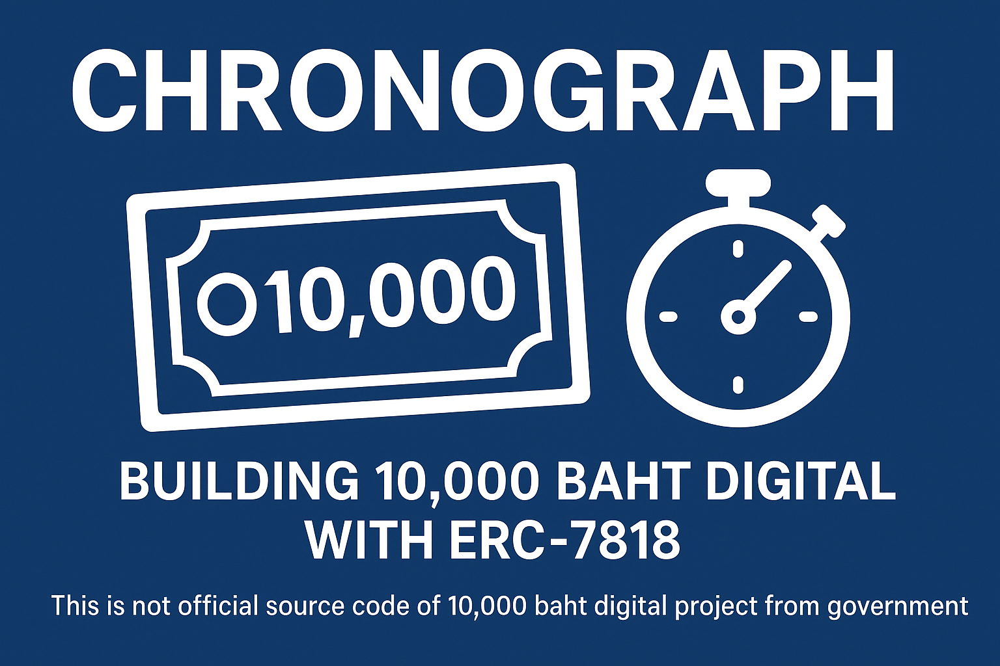

# Chronograph

<h1 align="center">

</h1>

Chronograph project is trying to build [10,000 baht digital](https://digitalwallet.go.th) with [ERC-7818](https://eips.ethereum.org/EIPS/eip-7818).

> [!IMPORTANT] Disclaimer
> This is not official source code of 10,000 baht digital project form government.

### Requirement

- Digital Money will expire 6 months after the date of receipt.
- Digital Money can only be spent at registered merchants participating in the program.
- Digital Money can only be used within the recipient’s domicile district.
- Digital Money can be withdrawn or converted into cash only after it has been circulated and spent at least 3 times.

### Possible Solution

- [ERC-1400: The Security Token Standard](https://www.polymath.network/erc-1400)
- [ERC-3643: T-REX - Token for Regulated EXchange](https://eips.ethereum.org/EIPS/eip-3643)
- [ERC-7291: Purpose bound money](https://eips.ethereum.org/EIPS/eip-7291)
- [ERC-7818: Expirable ERC20](https://eips.ethereum.org/EIPS/eip-7818)

### Why ERC-7818

ERC-1400, ERC-3643, and ERC-7291 provide useful compliance or restriction features, they all lack native support for expiration, which is the primary requirement of this project. ERC-7818 is chosen because it addresses expiration by design, while still leaving room to extend/customized with merchant roles, district restrictions, and cash-out policies.

### Approach

- Digital money lifespan is managed in compliance with [ERC-7818](https://eips.ethereum.org/EIPS/eip-7818).
- Merchants hold a `exception` role, meaning balances under merchant accounts are non-expiring.
- Transfer validation requires both the spender and recipient to be located within the same district.
- Cash-out should be restricted via access control/authorized roles. For circulation tracking, it should be implemented at the `UTXO` token layer for merchant-to-merchant (`B2B`) transfers, where multiple small `UTXOs` can be consolidated into a larger `UTXO`.

## Copyright

Copyright 2025 Sirawit Techavanitch. This repository release under the [GPL-3.0](./LICENSE) license